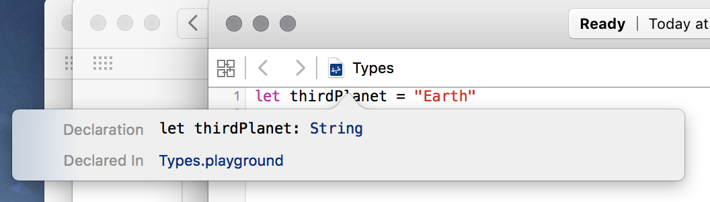
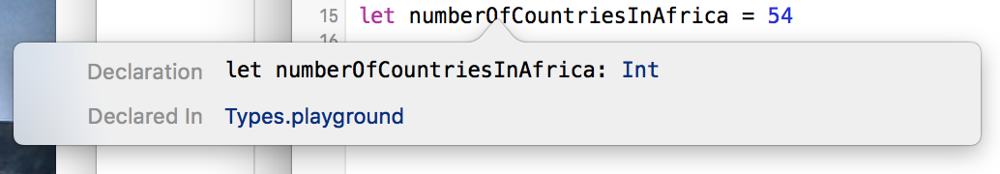

# Data Types: Strings and Ints


> Life is like riding a bicycle. To keep your balance, you must keep moving. ~[Albert Einstein](https://en.wikipedia.org/wiki/Albert_Einstein)

## Learning Objectives 

* Create strings using type annotation as such:
* Explain what the above code does in their own words:
* Explain the difference between type inference and type annotations. 
* Create a variable of type `Int`

## Strings

So far in your lessons, you've only been working with strings. "String" is a generic programming term for a sequence of characters. In Swift, the _data type_ that represents a string is also called a `String` (with a capital S). Swift strings are also sequences of characters. Often times, these characters are letters and numbers, and `String`s are recognizable as words and sentences. However, in Swift, a `String` can contain any character. In addition to alphanumeric characters like `a` and `9`, they can also be symbols such as `@` or `+`, or even a space. They can also be characters from languages other than English, such as `ñ` or `ß`. They can even contain other symbols, like `™` or `©`. If you can type it, you can put it in a `String`!

Let's investigate types. Create a new playground file and add this as the first line:

```swift
let thirdPlanet = "Earth"
```

What type is the constant `thirdPlanet`? If you guessed `String`, you're right!

Variables and constants in Swift are always associated with a type. In programming languages, a _type_ describes what kind of thing a variable or constant is. More importantly, a variable's type dictates how it behaves and what actions you can perform on it.

Consider two different kinds of things in the real world: a piece of paper and an aluminum can. You do things to a piece of paper that you would never do to a can, such as writing on it or crumpling it into a ball. You can't crumple a can (well, unless you smash it against your forehead, but that will hurt and you shouldn't do that)! Likewise, you do things to a can that you wouldn't do to a piece of paper, like drink out of it.

In programming languages, including Swift, variables and constants also have types that dictate the things you can do to them. You may remove blank spaces from the beginning and end of a string, which makes no sense on a number (they don't have blank spaces). Or you may divide a number by 10, but it doesn't make any sense to divide a string by 10. Swift keeps track of the types of variables and prevents you from doing things to them that don't make sense, which will help prevent errors from occurring in your programs.

The code `var s = "my string"` declares a variable `s` with a type of `String`, which means that `s` must always contain a `String` variable. So far, you haven't had to declare a variable's type; Swift has been able to _infer_ the type. Sometimes, though, you may declare a variable without a value. In this case, you have to declare its type, so Swift knows what it is. Add this to your playground file:

```swift
var ninthPlanet: String
```

What type is `ninthPlanet`? This time, you didn't associate it with a value immediately, so it could be anything, right?

But as you just learned, every variable in Swift has a type. Since you didn't set it to a value (yet), Swift can't figure out on its own what the type is, so you have to let it know. You do this by writing a colon after the variable name (`ninthPlanet`), and then the type of the variable `String`. Now Swift knows it's a `String`!

You can now give `ninthPlanet` a value. Set it to the string "Pluto" by adding this line to your playground:

```swift
ninthPlanet = "Pluto"
```


You risk a rebuke by Neil DeGrasse Tyson for doing this, but Swift has no problem letting you assign the string "Pluto" to `ninthPlanet`, because it's a totally valid string, and while Swift cares a lot about types, it doesn't care one bit about astronomy.

Let's take a closer look at the constant `thirdPlanet` that you already created in your playground file. Playgrounds have a nifty feature that let you find out some information (or _metadata_) about variables and constants. Hold down the <kbd>Option</kbd> key and hover your cursor over the `thirdPlanet` in your playground file. It will be highlighted and underlined in blue. Click once on it, and popup will appear:



Notice that the popup tells you that Swift considers `thirdPlanet` to be a `String`. You didn't even have to tell it that yourself—Swift figured it out on its own, because you assigned a string to `thirdPlanet` when you declared it.

Guess what? Swift has been doing this all along, for all the constants and variables you've created in your playgrounds. One of the nicest features of Swift is that it can often figure out the type of a variable on its own. You usually only have to explicitly tell Swift the type if you don't assign a value to the variable (like when you declared `ninthPlanet` without assigning anything to it).

Now add these lines to your playground:

```swift
let fifthPlanet: String = "Jupiter"
// fifthPlanet is a constant of type ______

let sixthPlanet: String = "Saturn"
// sixthPlanet is a constant of type ______

let seventhPlanet = "Uranus"
// seventhPlanet is a constant of type ______
```

Can you fill in the blanks? If you get stuck, remember that you can hold down the <kbd>Option</kbd> key and click on the constant's name to get information about it, including what type it is.

## Ints

Of course, you won't only be working with strings in Swift. You'll probably want to work with numbers at some point, too; after all, you are using a _computer_, and you'll probably want to _compute_ things, and that usually involves numbers, right?

Well, Swift has numbers! It actually has many kinds of numbers. The most basic one is an `Int`, which is short for _integer_. An `Int` can be a whole number (one without fractions or decimal components) ranging from -(2<sup>63</sup>) to 2<sup>63</sup>-1. There are several more kinds of numbers in Swift, but let's worry about those later. For now, let's just focus on the basic `Int`.

You declare variables and constants of type `Int` similarly to how you declare strings, except `Int` values must be a valid number, and you don't enclose the number in double quote marks (`"`). Here's how you declare a constant `Int` in Swift:

```swift
let numberOfCountriesInAfrica = 54
```

You've probably already guessed what type that is, even though you didn't explicitly declare it, but go ahead and <kbd>Option</kbd>-click on the name to see what Swift thinks it is, anyway. You should see this:



You've now learned about two different Swift types!

## Printing Strings and Ints

Remember when you did string interpolation in the last lesson? When you interpolate strings, you can use both `String` and `Int` types. You pass an `Int` variable or constant into the interpolated string exactly the same way you do a `String`.

Try adding these two lines to your playground:

```swift
let sixthPlanet = "Saturn"
let numberOfMoonsOfSaturn = 62
```

Can you print out the sentence "There are 62 moons orbiting Saturn" using string interpolation? Check this lesson's playground if you get stuck!

<a href='https://learn.co/lessons/DataTypes' data-visibility='hidden'>View this lesson on Learn.co</a>
